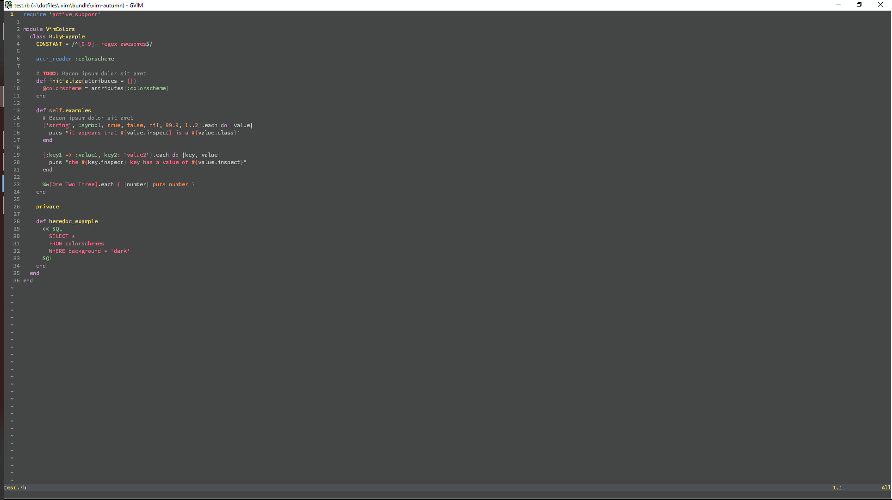

# Autumn colorscheme

VIM colorscheme with code based on that of Tomorrow-Night-Eighties



## Installation

### Using Vundle

```
Plugin 'https://gitlab.fi.muni.cz/xkana1/vim-wollf.git'
```

`:colorscheme autumn`

## Authors

* **Vojtech Kana** - *Initial work*

## License

This project is licensed under the MIT License - see the [LICENSE.md](LICENSE.md) file for details
